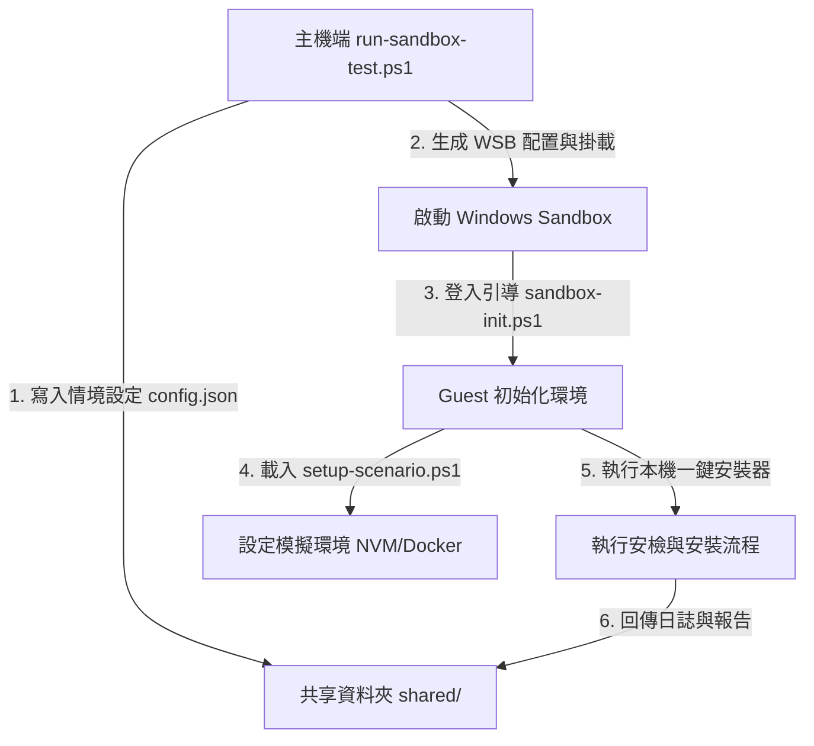

# Windows Sandbox 整合測試使用指南

本專案提供了一套基於 **Windows Sandbox (沙盒)** 的整合測試框架。此框架可建立乾淨且拋棄式的虛擬化環境，用以驗證 `install-course-toolchain-windows.ps1` 一鍵安裝器在不同學員系統狀態下的安裝邏輯與相容性。

---

## 系統需求與預備工作

要執行此沙盒整合測試，您的主機必須滿足以下條件：

1. **Windows 版本**：Windows 10 或 Windows 11 專業版 (Pro)、企業版 (Enterprise) 或教育版 (Education)。
   > [!NOTE]
   > Windows 家用版 (Home) 預設不支援 Windows Sandbox。
2. **啟用功能**：
   - 請於「開啟或關閉 Windows 功能」中勾選 **「Windows 沙盒」 (Windows Sandbox)** 與 **「虛擬機器平台」 (Virtual Machine Platform)**。
   - 確保電腦 BIOS 中的 **Virtualization Technology (VT-x / AMD-V)** 虛擬化功能已開啟。

---

## 測試框架工作架構

測試框架由以下三個核心檔案協調運作：



1. **[run-sandbox-test.ps1](file:///d:/02.Projects/ai-class-agexamples/ag-course-index/tests/sandbox/run-sandbox-test.ps1) (主機端)**：自動生成 `.wsb` 設定檔，配置共享資料夾（用於主機與沙盒傳輸檔案），並呼叫 `WindowsSandbox.exe` 啟動。
2. **[sandbox-init.ps1](file:///d:/02.Projects/ai-class-agexamples/ag-course-index/tests/sandbox/sandbox-init.ps1) (沙盒內)**：沙盒開機登入後自動執行，讀取設定並呼叫情境設定腳本。
3. **[setup-scenario.ps1](file:///d:/02.Projects/ai-class-agexamples/ag-course-index/tests/sandbox/scenarios/setup-scenario.ps1) (情境設定)**：在沙盒內部署測試情境（如預裝舊版 NVM、或佈置假的 Docker 執行檔）。

---

## 支援的測試情境 (Scenarios)

目前整合測試支援以下三種情境：

| 情境名稱 | 說明 | 模擬的學員環境 |
| :--- | :--- | :--- |
| **`Clean`** | 完全乾淨的 Windows 11 系統環境。 | 未裝任何開發工具的全新電腦。 |
| **`NvmInstalled`** | 預裝了 NVM for Windows，且選用舊版 Node.js v20.19.6。 | 裝有 NVM 導致與 WinGet Node.js LTS 產生衝突的環境。 |
| **`DockerStopped`** | 已安裝 Docker 相關執行指令，但背景 Daemon 未啟動。 | 已安裝 Docker Desktop 但軟體未開啟的環境。 |

---

## 執行步驟

請於您的開發主機上以系統管理員身分開啟 PowerShell，切換至專案根目錄，並依需要執行以下情境指令：

### 1. 執行乾淨環境測試 (Clean)
```powershell
powershell -File .\tests\sandbox\run-sandbox-test.ps1 -Scenario Clean
```

### 2. 執行 NVM 衝突環境測試 (NvmInstalled)
```powershell
powershell -File .\tests\sandbox\run-sandbox-test.ps1 -Scenario NvmInstalled
```

### 3. 執行 Docker 未啟動測試 (DockerStopped)
```powershell
powershell -File .\tests\sandbox\run-sandbox-test.ps1 -Scenario DockerStopped
```

---

## 檢視測試結果

當沙盒開機執行完畢後，它會自動將結果回傳至主機端的共享目錄 `tests/sandbox/shared/` 下，您無須在沙盒內手動抓取：

* **執行日誌 (`log.txt`)**：一鍵安裝程式在沙盒內的完整控制台 stdout 輸出日誌。
* **結構化報告 (`result.json`)**：一鍵安裝程式所產生的 Readiness Report 最終 JSON 數據，可用於比對各工具的狀態。

> [!TIP]
> 測試完成後，直接關閉 Windows Sandbox 視窗即可釋放所有資源，沙盒內的所有變更將被完全還原。
