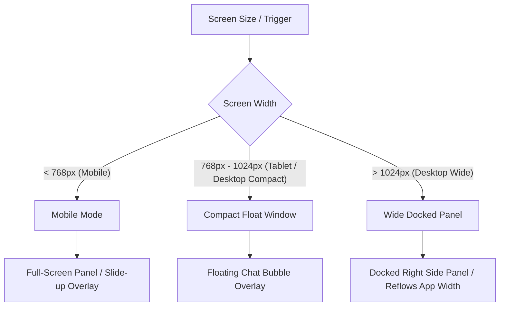

# AI Agent UI Support

Add a reusable AI Agent interface to an existing web application.

The Agent should act as a supporting capability of the application. Preserve the application's existing navigation, layout, workflows, design system, state management, and business UI unless changes are required for Agent integration.

The implementation should be provider-agnostic whenever practical. It may use Gemini, OpenAI, Anthropic, local models, or other Agent-capable APIs.

Provider-specific features should be exposed through capability detection rather than hard-coded assumptions.

---

# 1. Attach an Agent Chat View to Web Application

The Agent Chat View must provide:

1. Chat View
2. Text Input
3. User / Agent Message Bubble
4. Markdown display support
5. Quick Reply / Follow-up Actions
6. Agent Loading state
7. Agent Activity state
8. Session Management
9. Long Task support
10. Task Management Panel
11. Multiple file input
12. Photo and camera input
13. Speech-to-text input
14. Tool / Function Calling activity display
15. RWD support

The Chat View must be implemented as a reusable feature that can be integrated into different web applications without requiring the application itself to become Agent-centric.

---

# 2. Message View

Use Message Bubbles for conversation.

```text
Agent Bubble                        

                         User Bubble
```

Requirements:

* User Bubble aligns right.
* Agent Bubble aligns left.
* Agent Bubble supports Markdown.
* Long responses remain readable.
* Code blocks render correctly.
* Tables support responsive display or horizontal scrolling.
* Links are clickable.
* Errors are clearly distinguishable from normal Agent responses.
* Tool execution results may be rendered as structured content.
* Attachments sent by the user should remain visible with the corresponding message.

Markdown should support at least:

* Heading
* Bold
* Italic
* Ordered list
* Unordered list
* Inline code
* Code block
* Table
* Quote
* Divider
* Link

When the Agent has predefined possible next actions, display Quick Reply / Follow-up Buttons below the Agent message.

Examples:

```text
[Continue]
[View Details]
[Generate Report]
[Open Record]
[Retry]
```

Quick Replies must correspond to actions that can actually be executed.

---

# 3. Chat Scrolling Behavior

When new messages arrive:

* Automatically scroll to the newest message when the user is already near the bottom.
* Do not force-scroll when the user is reading previous messages.
* Preserve the user's current reading position when older messages or history are loaded.
* Agent Activity changes follow the same rule.

---

# 4. Multiple File Input

Support multiple file inputs in one message.

The Agent UI should support all file types accepted by the currently selected provider and model.

Possible formats include:

```text
txt
csv
pdf
xlsx
docx
ppt
pptx
json
md
and other provider-supported formats
```

Do not hard-code the supported format list as the source of truth.

Actual support must be determined from:

* Current Provider
* Current Model
* API capability
* File size limitations
* Attachment count limitations

The UI must support:

* Multiple file selection
* Multiple files in one message
* File name display
* File type display
* File size display when useful
* Upload progress
* Upload loading state
* Remove individual attachment
* Unsupported format error
* File-too-large error
* Upload failure and retry

Attachments must be previewed before sending when practical.

---

# 5. Photo Input

Support image input through:

```text
Upload Photo
Capture with Camera
```

Support all image formats accepted by the selected provider/model, such as:

```text
jpg
jpeg
png
webp
and other supported image formats
```

Support:

* Single image upload
* Multiple image upload
* Image preview
* Remove image before sending
* Camera capture
* Camera permission handling
* Upload failure
* Unsupported format
* Unsupported model capability

Camera capture should only appear when the current browser/device supports it.

---

# 6. Speech-to-Text Input

Speech-to-text is used as a method for entering text into the normal Chat Input.

It is not automatically a real-time voice conversation.

The required flow is:

```text
[MIC]
  ↓
Start Recording
  ↓
Recording...
  ↓
User manually stops recording
  ↓
Transcribing...
  ↓
Text inserted into Chat Input
  ↓
User reviews / edits
  ↓
[SEND]
```

Requirements:

* Click `[MIC]` to start recording.
* Recording must continue until the user explicitly stops it.
* Do not automatically stop recording because of silence.
* Click the microphone control again, or an explicit Stop control, to stop.
* Show an obvious recording state.
* Show recording elapsed time when practical.
* After recording stops, show a transcription loading state.
* Convert recorded audio into text.
* Insert the result into the Chat Input.
* Do not automatically send the transcribed result.
* The user must be able to edit the transcription before sending.

Handle:

* Microphone permission denied
* Recording cancelled
* Unsupported browser
* Unsupported provider/model
* Transcription error
* Retry

Speech-to-text must not break normal text input behavior.

---

# 7. Text Input Behavior

The text input must support:

* Single-line input
* Multi-line input
* Automatic input height expansion when appropriate
* `Enter` to send
* `Shift + Enter` for newline
* Chinese IME
* Other composition-based IME input
* Placeholder
* Sending state
* Error recovery
* Text + attachments in the same message

During IME composition, `Enter` must not accidentally send the message.

```javascript
// Example: Composition & Keydown Handling
let isComposing = false;

inputElement.addEventListener('compositionstart', () => {
  isComposing = true;
});

inputElement.addEventListener('compositionend', () => {
  isComposing = false;
});

inputElement.addEventListener('keydown', (e) => {
  if (e.key === 'Enter') {
    // If composing in IME or composition keycode is active, do not submit
    if (isComposing || e.isComposing || e.keyCode === 229) {
      return;
    }
  
    // Send message on Enter, allow line breaks on Shift+Enter
    if (!e.shiftKey) {
      e.preventDefault();
      if (isValidMessage()) {
        sendMessage();
      }
    }
  }
});
```

---

# 8. Chat View RWD

The Agent interface must support responsive web design.

The primary responsive modes are:

```text
Desktop Narrow
Desktop Wide
Mobile
```



---

# 9. Desktop Narrow Layout

On desktop with narrow available width:

Show the Agent as a Floating Action Button at the bottom-right when closed.

```text
┌──────────────────────────────┐
│                              │
│       Main Application       │
│                              │
│                         [AI] │
└──────────────────────────────┘
```

The user can open or close the Chat View.

When opened, show a floating Agent Window.

The Agent Window should:

* Remain above the main application.
* Avoid covering critical application controls when possible.
* Support resize.
* Support close.
* Preserve the current Session after closing.

---

# 10. Desktop Wide Layout

On desktop with wide available width:

When Chat View is open, display it as a full-height right-side panel.

```text
┌───────────────────────────────┬──────────────┐
│                               │              │
│                               │    Agent     │
│       Main Application        │    Chat      │
│                               │    View      │
│                               │              │
└───────────────────────────────┴──────────────┘
```

Requirements:

* Agent Panel is on the right-hand side.
* Agent Panel uses full available height.
* Main application uses the remaining width.
* Main application content must not be hidden underneath the Agent.
* The Agent Panel remains closable.
* Closing the Agent returns it to the compact/FAB state.
* Resizing may allow switching between floating and docked presentation.

---

# 11. Mobile Layout

When closed:

```text
┌──────────────────┐
│                  │
│ Main Application │
│                  │
│             [AI] │
└──────────────────┘
```

Show the Agent FAB at the bottom-right.

When opened:

```text
┌──────────────────┐
│ Agent Toolbar    │
├──────────────────┤
│                  │
│                  │
│   Chat Messages  │
│                  │
│                  │
├──────────────────┤
│ Chat Input       │
└──────────────────┘
```

Use full-screen or near-full-screen Chat View.

Handle:

* Safe-area inset
* Mobile keyboard
* Touch targets
* Camera permission
* Microphone permission
* Back navigation
* Close behavior

---

# 12. Chat View Layout

The Chat View contains:

```text
┌──────────────────────────────────────┐
│              Top Toolbar             │
├──────────────────────────────────────┤
│                                      │
│             Chat Messages            │
│                                      │
│                                      │
│           Agent Activity             │
├──────────────────────────────────────┤
│ [+]       ___input___    [MIC][SEND] │
└──────────────────────────────────────┘
```

The general layout and control placement should remain recognizable across desktop and mobile.

---

# 13. Top Toolbar

The Top Toolbar must provide:

```text
[New Chat] [History] [Settings] [Resize] [Close]
```

Required actions:

* New Chat
* Chat History / Session History
* Settings
* Resize / Dock
* Close

If horizontal space becomes crowded, lower-priority actions should move into an overflow/drop-down menu.

Example:

```text
[New Chat]                  [⋮] [X]

[⋮]
 ├─ History
 ├─ Settings
 └─ Resize
```

Do not remove functionality merely because space is limited.

---

# 14. Bottom Toolbar

The bottom toolbar must use this conceptual structure:

```text
[+]       ___input___       [MIC][SEND]
```

Do not replace this interaction model with unrelated layouts unless required by the host application's accessibility or platform constraints.

---

# 15. `[+]` Attachment Button

`[+]` handles file / photo import.

When clicked, possible actions include:

```text
[+]
 ├─ Upload File
 ├─ Upload Photo
 └─ Take Photo
```

Requirements:

* Support multiple files at once.
* Support multiple images at once.
* When more than one import flow exists, show a dropdown / popover / action menu.
* Hide unsupported import flows.
* Show selected attachments before send.
* Allow individual attachment removal.

---

# 16. `[MIC]` Button

`[MIC]` starts speech-to-text recording.

Behavior:

```text
[MIC]
  ↓
Recording
  ↓
[STOP]
  ↓
Transcribing...
  ↓
Insert Text into Input
```

The recording must not automatically stop.

The user controls when recording ends.

The transcription result must return to:

```text
___input___
```

so the user can correct mistakes before pressing `[SEND]`.

---

# 17. `[SEND]` Button

`[SEND]` sends the current message.

The message may include:

* Text
* Files
* Images
* Any combination supported by the provider/model

Disable `[SEND]` when there is no valid content to send.

Show sending/loading state after submission.

---

# 18. Agent Loading and Activity State

The Chat View must contain a persistent Agent Activity area near the end of the conversation.

It must dynamically describe what the Agent is currently doing.

Minimum states:

```text
Idle
Thinking
Running Tool
Long Task
Live Voice
```

Additional states may include:

```text
Uploading
Transcribing
Generating
Planning
Waiting for Tool
Consolidating
Error
```

Example display:

```text
◌ Thinking... 8s

⚙ Running tool: Search products... 3s

◌ Running task 2/5:
  Compare available options... 18s
```

When busy:

* Show elapsed seconds.
* Update elapsed time continuously.
* Show current processing stage.
* Show the human-readable Tool / Task name when available.

When idle:

* Keep the activity indicator visible in a subdued state.

Do not create permanent chat messages for every temporary activity-state update.

If the user is near the bottom, activity changes may auto-scroll into view.

If the user is reading older messages, do not force-scroll.

---

# 19. Session Management

The Agent must support Session Management.

Required functions:

```text
New Session
Save Current Session
Session History
Switch Session
Delete Session
Rename Session
```

Each Session should support:

* Automatically generated title
* Manual rename
* Creation time
* Last updated time
* Conversation history
* Attachment metadata when required
* Relevant Agent context metadata when required

Example Session History:

```text
Chat History

Today
────────────────────────
Product inventory question
10:42

Generate monthly report
09:18

Yesterday
────────────────────────
Customer service analysis
16:20
```

Opening a Session restores its conversation.

Closing and reopening the Agent must preserve the current Session.

Starting `[New Chat]` creates a new Session.

Session persistence may use the application's existing storage architecture.

Possible storage includes:

* localStorage
* IndexedDB
* Server-side database
* Existing application persistence layer

Do not force a different persistence architecture when the host application already provides one.

---

# 20. Long Task Support

The Agent must support long or complex tasks that should not be handled as one oversized response.

Examples:

* Large research tasks
* Multi-source research
* Large data processing
* Long report generation
* Tasks with many Tool calls
* Multi-step application operations
* Tasks expected to exceed a practical single-response context/output size

The Agent should be able to divide the request into ordered subtasks.

The decision to split a task should be made by the Agent/model based on complexity and scope.

Do not use frontend keyword matching to decide whether something is a long task.

Simple questions must not be unnecessarily converted into task plans.

---

# 21. Long Task Planning

Provide an internal long-task planning mechanism, such as:

```text
planLongTasks
```

The implementation name may differ when required by the Agent framework, but the capability must exist.

A task plan contains:

```text
Objective
Task 1
Task 2
Task 3
...
```

A reasonable default maximum is approximately 10 subtasks unless the application requires otherwise.

Each subtask should be independently bounded.

Each task execution should receive:

* Overall objective
* Current subtask
* Necessary previous task results
* Required runtime context
* Available Tools

Avoid repeatedly sending unnecessary complete chat history into every subtask.

---

# 22. Long Task Execution

Long tasks execute sequentially or according to valid dependencies.

Each subtask may use:

* Application Tools
* Function Calling
* Provider built-in tools
* Web Search
* Retrieval / RAG
* Other Agent capabilities

A failed subtask must not automatically terminate unrelated remaining tasks.

Instead:

```text
Task 1  ✓
Task 2  ✓
Task 3  ✕
Task 4  ✓
```

Continue when possible.

When all tasks finish:

1. Consolidate successful results.
2. Clearly identify failed or incomplete tasks.
3. Produce a final response.
4. Add the final response to the Chat View.

---

# 23. Task Management Panel

When a long task exists, the Chat View must display a Task Management Panel.

Example:

```text
┌──────────────────────────────────┐
│ Research competitor products     │
│ Running              2 / 5       │
│ ████████░░░░░░░░ 40%             │
├──────────────────────────────────┤
│ ✓ Search available products      │
│ ✓ Collect pricing                │
│ ◌ Compare specifications         │
│ ○ Analyze differences            │
│ ○ Generate final report          │
└──────────────────────────────────┘
```

Required overall states:

```text
Running
Consolidating
Completed
Partially Failed
```

Each task must display a state:

```text
Pending
Running
Done
Failed
```

Suggested visual mapping:

```text
○ Pending
◌ Running
✓ Done
✕ Failed
```

Completed tasks should include a short result summary when useful.

---

# 24. Task Panel Collapse / Expand

The Task Management Panel must support:

```text
[Collapse]
[Expand]
```

Expanded state:

```text
Research competitor products
Running 2 / 5
████████░░░░░░ 40%

✓ Search products
✓ Collect prices
◌ Compare products
○ Analyze differences
○ Generate report
```

Collapsed state:

```text
Research competitor products
Running 2 / 5
████████░░░░░░ 40%
```

Even when collapsed, preserve:

* Status
* Completed / Total count
* Progress bar

After completion, retain the Task Panel for review.

It may be cleared when the next independent user request or task plan begins.

---

# 25. Quick Reply and Follow-up Actions

The Agent can attach contextual follow-up actions to its responses.

Examples:

```text
[Continue]
[Retry]
[View Result]
[Open Page]
[Apply Changes]
[Generate Report]
```

Follow-up actions should be generated from:

* Tool results
* Application context
* Structured Agent output
* Explicit UI configuration

Buttons must not promise actions that are unavailable.

---

# 26. Chat View Setup

The Agent must provide a Settings panel.

The required conceptual setup layout is:

```text
API KEY
[____________________________] [Save]

Model
[Model Drop Down List        ] [Refresh]

Other Model
[Other Model Drop Down List  ]

Other Model Settings
[...]

System Prompt
[                              ]
[                              ]
[                              ]

Built-in Tools
[✓] Web / Google Search
[ ] Code Execution
[ ] Other Provider Tool
```

These explicit actions must not be abstracted away.

---

# 27. API KEY `[Save]`

The API Key field must have an explicit `[Save]` button.

```text
API KEY
[____________________________] [Save]
```

Required flow:

```text
Enter API Key
      ↓
    [Save]
      ↓
Checking availability...
      ↓
 ┌───────────────┐
 │ Valid         │
 │ Invalid       │
 └───────────────┘
```

When `[Save]` is clicked:

1. Enter loading state.
2. Validate the API Key / authentication against the selected provider.
3. Confirm that the provider API is reachable.
4. Display success or failure.
5. Save the configuration only when the validation succeeds.
6. Preserve the previous valid configuration if the new key fails validation.

Possible UI states:

```text
API KEY
[****************************] [Save]
✓ Connected
```

or

```text
API KEY
[____________________________] [Save]
✕ Invalid API Key
```

Do not silently save API Key changes on:

* Blur
* Field change
* Settings panel close

The explicit `[Save]` action is required.

Saved secrets must not be displayed in full.

Production credential storage must follow the security model of the host application.

---

# 28. Model Drop Down List `[Refresh]`

The primary model selector must have an explicit `[Refresh]` button.

```text
Model
[Model Drop Down List ▼] [Refresh]
```

The model list should be dynamically loaded from the provider whenever the API supports model discovery.

Do not rely only on hard-coded model names.

Required behavior:

### Manual Refresh

Click:

```text
[Refresh]
```

to retrieve the latest model list.

During refresh:

```text
Model
[Loading models...      ] [Refresh]
```

### API Key Changed

After a new API Key is successfully saved:

```text
API Key Changed
      ↓
Validate API Key
      ↓
Validation Success
      ↓
Automatically Refresh Model List
```

Automatic refresh does not remove the manual `[Refresh]` button.

### Model Preservation

After refresh:

* Keep the current model selected if it is still available.
* If the model is no longer available, select or request a valid replacement.
* Clearly show model-list loading errors.

---

# 29. Other Model Drop Down Lists

Support additional model selectors when different Agent capabilities require different models.

Examples:

```text
Chat Model
[Model ▼] [Refresh]

Speech-to-Text Model
[Model ▼]

Realtime Voice Model
[Model ▼]

Embedding Model
[Model ▼]

Vision Model
[Model ▼]
```

Only show additional model selectors that are relevant to the current provider and enabled capabilities.

Do not create unnecessary selectors when one model handles all required capabilities.

When authentication changes, dependent model lists should refresh as required.

---

# 30. Other Model Settings

Provide model settings supported by the selected model/provider.

Possible settings include:

```text
Temperature
Maximum Output Tokens
Reasoning Level
Top P
Streaming
Structured Output
Voice
Response Modality
Other Provider-Specific Settings
```

Only display settings that are actually supported.

Model settings should update when the selected model changes.

---

# 31. System Prompt

Provide an editable System Prompt field.

```text
System Prompt

┌──────────────────────────────────┐
│                                  │
│                                  │
│                                  │
└──────────────────────────────────┘
```

System Prompt configuration should remain separate from automatically injected runtime application context.

The implementation may compose:

```text
Base Agent Instructions
+
User-configurable System Prompt
+
Runtime Application Context
```

The user should not need to manually copy current application state into the System Prompt.

---

# 32. Built-in Provider Tools

Allow supported provider-native tools to be enabled or disabled.

Example:

```text
Built-in Tools

[✓] Google Search
[ ] Code Execution
[ ] File Search
[ ] URL Context
```

For Gemini, this may include:

```text
Google Search
Code Execution
URL Context
```

For other providers, display equivalent provider-native capabilities.

The list must be capability-driven.

Do not display unsupported provider tools.

Provider-native tools and application-defined Custom Tools / Function Calls are separate concepts.

---

# 33. Settings Dependency Flow

Settings should update dependent capabilities automatically.

```text
API KEY
  ↓
[Save]
  ↓
Validate
  ↓
Connected
  ↓
Refresh Models
  ↓
Select Model
  ↓
Detect Model Capabilities
  ↓
Refresh:
- Other Models
- Model Settings
- Built-in Tools
- File Support
- Image Support
- Speech Support
- Other Agent Capabilities
```

The Agent UI should therefore react to authentication and model changes instead of treating settings as unrelated static fields.

---

# 34. Capability Detection

Agent controls must reflect actual provider/model/browser capabilities.

Possible capabilities include:

* Text
* Streaming
* File Input
* Image Input
* Camera Input
* Speech-to-Text
* Realtime Voice
* Tool Use
* Function Calling
* Web Search
* File Search
* Retrieval
* Code Execution
* Structured Output
* Other provider-native capabilities

```typescript
interface ModelCapabilities {
  supportsStreaming: boolean;
  supportsImageInput: boolean;
  supportsFileInput: boolean; // CSV, PDF, XLSX, etc.
  supportsAudioInput: boolean;
  supportsRealtimeVoice: boolean;
  supportsToolUse: boolean;
  supportedFileExtensions: string[];
}

interface ProviderAdapter {
  getCapabilities(modelName: string): ModelCapabilities;
  generateContentStream(request: GenerateRequest): AsyncIterable<GenerateResponse>;
  executeTool(name: string, args: Record<string, any>): Promise<any>;
}
```

When unsupported:

* Hide the feature if irrelevant.
* Disable it with an explanation if the user should know it exists.
* Provide fallback behavior where practical.

---

# 35. Tool / Function Calling Integration

During development, inspect the existing application and identify functions that should be exposed to the Agent as Tools / Function Calls.

The Agent is expected to do more than answer questions when the application has useful executable capabilities.

Recommend or implement a Tool when the Agent needs to:

* Read application data
* Search application records
* Retrieve current application state
* Create data
* Update data
* Delete data
* Generate reports
* Save generated results
* Navigate to a specific application state
* Execute an existing application action
* Coordinate several application operations
* Perform a multi-step workflow
* Run RAG or internal search
* Trigger external services through the application

---

# 36. Do Not Replace Simple UI with Chat

Do not convert every existing application feature into Agent interaction.

Prefer existing traditional UI for operations that are:

* Simple
* Predictable
* High frequency
* Easier with a button
* Easier with a form
* Easier with a menu
* Easier with direct manipulation

Prefer Agent / Tool interaction for operations involving:

* Natural-language intent
* Ambiguous requests
* Cross-feature workflows
* Multi-step work
* Data aggregation
* Context-dependent operations
* Complex search
* Repetitive administrative workflows

The Agent complements the existing application UI.

It does not replace the application's primary interaction model.

---

# 37. Tool Definition

Each application Tool should define:

```text
name
description
parameters / input schema
return type / output schema
handler
error handling
```

Recommended additional metadata:

```text
user-facing label
activity label
permission requirement
confirmation requirement
```

Tool names should normally use verbs.

Examples:

```text
searchProducts
getProductDetails
createReport
updateTask
deleteItem
navigateToRecord
saveDocument
```

---

# 38. Tool Execution UI

When an Agent invokes a Tool, Agent Activity must reflect the operation.

Example:

```text
⚙ Searching inventory...
```

instead of exposing only:

```text
running searchProducts()
```

Use a human-readable activity label.

If multiple Tool rounds occur, the UI should continue updating the same Agent Activity area rather than generating excessive system messages.

---

# 39. Tool Execution Integrity

The Agent must not claim an application operation succeeded unless the real Tool handler returned success.

Required flow:

```text
Agent decides to execute action
        ↓
Call Tool
        ↓
Application handler executes
        ↓
Tool returns result
        ↓
Application state updates
        ↓
Agent reports confirmed result
```

For state-changing operations, the actual application state is the source of truth.

Do not simulate success through Agent text.

---

# 40. Application Context

Provide relevant current application context to the Agent when needed.

Possible context includes:

* Current route
* Current page
* Current selected item
* Current filters
* Current form state
* Visible records
* Current user permissions
* Available actions
* Relevant business state

Do not send irrelevant application data merely because it exists.

---

# 41. Architecture Separation

Keep the Agent UI reusable.

Recommended responsibility separation:

```text
Agent Components
    ↓
Agent UI / interaction

Agent State
    ↓
Chat / Session / Task / Activity state

Agent Provider Service
    ↓
Model API communication

Tool Service
    ↓
Function registration and execution

Repository / Persistence
    ↓
Session and settings persistence

Provider Adapter
    ↓
Provider-specific capability mapping
```

| Layer | Responsibility |
| --- | --- |
| **Agent Components** | visual presentation (visual message list, bubbles, headers, composers, FAB, settings UI) |
| **Agent State** | interaction behavior (handles IME listeners, composer heights, state mappings, file selection handlers) |
| **Agent Provider Service** | model and API communication |
| **Tool Service** | Tool registration and execution |
| **Repository / Persistence** | session and settings persistence |
| **Provider Adapter** | provider-specific capability mapping |

Reuse the host application's existing:

* Component system
* State management
* Styling
* Routing
* Persistence
* API architecture

Do not introduce a new application framework solely to support the Agent.

---

# 42. Minimum Acceptance Criteria

The Agent UI is complete only when all applicable requirements below pass.

## Chat UI

* Chat View can open and close.
* Desktop narrow layout supports bottom-right FAB.
* Desktop wide layout supports full-height right-side panel.
* Mobile open state supports full-screen / near-full-screen Chat View.
* Message Bubble layout works.
* Markdown renders correctly.
* Quick Reply works.
* Agent Loading state is visible.
* Agent Activity is visible.

## Input

* `[+] ___input___ [MIC][SEND]` interaction is preserved.
* Text Input supports multiline.
* Enter sends.
* Shift + Enter creates newline.
* IME composition does not accidentally send.
* Multiple files can be selected.
* Multiple attachments can be removed individually.
* Photos can be uploaded.
* Camera capture works when supported.

## Speech-to-Text

* `[MIC]` starts recording.
* Recording does not automatically stop.
* User manually stops recording.
* Transcription loading is shown.
* Transcription returns to the editable Chat Input.
* Transcription is not automatically sent.

## Session

* `[New Chat]` creates a new Session.
* Session history can be opened.
* Historical Sessions can be switched.
* Session can be renamed.
* Session can be deleted.
* Session titles can be automatically generated.
* Creation / update time is retained.
* Closing the Agent preserves the current Session.

## Long Tasks

* Agent can determine when a request should become a long task.
* Long tasks can be divided into subtasks.
* Simple requests are not unnecessarily split.
* Individual task failure does not automatically abort unrelated tasks.
* Final results are consolidated after execution.

## Task Management Panel

* Overall status is visible.
* `Completed / Total` is visible.
* Progress bar is visible.
* Pending / Running / Done / Failed states are visible.
* Completed tasks may show summaries.
* Panel supports collapse / expand.
* Collapsed state still shows status, count, and progress.

## Agent Activity

* Idle state exists.
* Thinking state exists.
* Running Tool state exists.
* Long Task state exists.
* Busy states show elapsed time.
* Tool / Task activity uses readable names.
* Activity updates do not pollute permanent chat history.
* Auto-scroll does not interrupt users reading older messages.

## Settings

The following explicit controls must exist:

```text
API KEY [Save]

Model Drop Down List [Refresh]

Other Model Drop Down Lists

Other Model Settings

System Prompt

Enable / Disable Built-in Tools
```

* `[Save]` validates API availability before accepting a new API Key.
* Invalid keys are not treated as saved valid credentials.
* Successful API Key change automatically refreshes Model options.
* `[Refresh]` manually refreshes the Model list.
* Model list is dynamic when provider discovery exists.
* Other model lists appear when required.
* Model-specific settings reflect current capabilities.
* System Prompt is editable.
* Provider built-in tools can be configured when the provider exposes them.

## Tools

* Application functions suitable for Agent interaction are identified.
* Relevant functions are exposed as Tools / Function Calls.
* Tool execution uses actual application handlers.
* Tool errors are displayed clearly.
* Agent does not falsely claim Tool success.
* Chat, long tasks, and other Agent interaction modes reuse the same Tool handlers whenever practical.

---

# 43. Core Design Principle

The resulting experience should feel like:

```text
Existing Web Application
        +
Reusable AI Agent Assistance
        +
Application-aware Tools
```

not:

```text
Chatbot replacing the entire application
```

The Agent should be easy to discover, easy to open, easy to dismiss, aware of the application's current context, capable of operating the application through real Tools, and capable of clearly exposing its current state when work takes more than a normal conversational turn.
