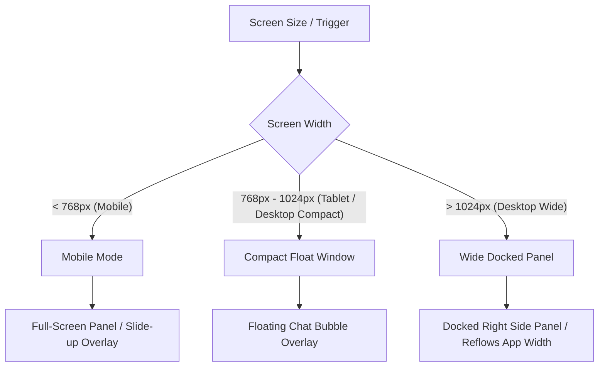

# AI Agent UI & Integration Support Skill

This skill provides design, architectural, and implementation guidelines for embedding an AI Agent interface as a **supporting assistant** within an existing web application.

## 1. Architectural & Integration Philosophy

### A. Non-Intrusive Integration

- **Preserve the Host Application**: The Agent must not replace or disrupt the primary application workflows, navigation, or layout. It acts as a sidekick or overlay.
- **Technology Alignment**: Reuse the host application's existing design system, component library, state management (e.g., Redux, Zustand, React Context, Pinia), and styling approach (Vanilla CSS, Tailwind, or CSS Modules). Do not inject heavy new frameworks or duplicate UI libraries unless absolutely necessary.
- **Provider-Agnostic Core**: Keep the UI components and client-side controllers isolated from the specific model provider (Gemini, OpenAI, Anthropic, Ollama, etc.) via an abstraction or Adapter layer.

### B. UI/UX Decision Framework: Conversation vs. Traditional UI

Do not force everything into a chat message. Keep simple, predictable, or high-precision tasks inside standard UI forms, menus, and buttons.

- **Use Conversational Interaction for**: Ambiguous queries, natural-language filtering, cross-page updates, multi-step coordination, data synthesis, and complex assistance.
- **Use Traditional UI for**: Toggling simple filters, editing a single input field, single-click actions, and browsing highly visual lists.

---

## 2. Agent Chat View & Responsive Layouts

The Chat View must support standard message bubbles (User on the right, Agent on the left), markdown rendering (using safe renderers + sanitization), quick replies, tool execution indicators, and robust scrolling.

### A. Responsive Layout States



#### 1. Closed State (All Screens)

- Render an **Agent Floating Action Button (FAB)** at the bottom-right corner.
- Include hover, focus, active states, and an accessible label (`aria-label="Open AI Assistant"`).
- Optionally show a small unread notification dot or a completed-task indicator badge.

#### 2. Desktop — Compact Width (< 1024px)

- Render the Agent as a **floating chat window** that overlays application content in the bottom-right.
- Do not block critical global controls.
- Support resizing or size switching (e.g., Compact vs. Large).
- Provide a clear Close (`X`) button to return to the FAB.

#### 3. Desktop — Wide Width (>= 1024px)

- Allow docking the Agent as a **full-height right-side panel**.
- **Crucial**: The main application content must reflow to use the remaining width. Do not cover or hide application content underneath the docked panel.
- Do not reserve layout space when the Agent is closed. Reflow back to full width.

#### 4. Mobile Layout

- Render the opened Agent as a **full-screen or near-full-screen view** (e.g., drawer or modal sliding from the bottom/right).
- Respect **safe-area insets** (`env(safe-area-inset-bottom)`).
- Handle mobile keyboard display smoothly without hiding the input field or blocking content.
- Ensure large, touch-friendly touch targets (minimum `44px x 44px`).

### B. Scrolling & Readability

- **Auto-scroll to bottom** on new messages **only** if the user is already near the bottom (e.g., within 100px).
- **Preserve reading position** when the user has scrolled up to review history. Do not force-scroll them to the bottom when the Agent streams a response.

### C. Agent Window Header

- **Top Toolbar Controls**: The top header bar of the Agent window must include:
  - Agent Title or current conversation context.
  - New Chat (to start a fresh session).
  - Session History (to view/load past sessions).
  - Settings (to adjust provider/model parameters).
  - Resize/Dock Toggle (to switch between compact floating and wide docked modes).
  - Close button.
- **Overflow & Space Conservation**:
  - When horizontal space is restricted (e.g., on mobile or very compact windows), group lower-priority header actions (such as Settings, History, or Docking controls) into an overflow dropdown/menu button.
  - Do not crowd the toolbar with too many icon-only buttons.
  - Use clear text labels, tooltips, or accessible names (`aria-label`) so screen readers can describe the buttons correctly.

---

## 3. Message Composer & Input Flows

The input area sits at the bottom of the chat window: `[+] [Message Input] [MIC] [SEND]`.

### A. Composer Logic & IME Safety

Ensure perfect multi-line auto-growing text area input. Keydown listeners must handle Chinese/Japanese/Korean Input Method Editors (IME) correctly to prevent premature sending.

> Code samples in this skill (here and in §8) are illustrative pseudocode showing the required behavior, not a library to import verbatim. Port the underlying logic (IME guard, capability shape) to the host app's actual framework and state layer (React/Vue/Svelte, Redux/Zustand/Pinia/Context, etc.).

```javascript
// Example: Composition & Keydown Handling
let isComposing = false;

inputElement.addEventListener('compositionstart', () => {
  isComposing = true;
});

inputElement.addEventListener('compositionend', () => {
  isComposing = false;
});

inputElement.addEventListener('keydown', (e) => {
  if (e.key === 'Enter') {
    // If composing in IME or composition keycode is active, do not submit
    if (isComposing || e.isComposing || e.keyCode === 229) {
      return;
    }
  
    // Send message on Enter, allow line breaks on Shift+Enter
    if (!e.shiftKey) {
      e.preventDefault();
      if (isValidMessage()) {
        sendMessage();
      }
    }
  }
});
```

- **Draft Recovery**: If sending fails, retain the user's text in the input box so they do not lose their draft.
- **Disabled State**: Disable the Send button and text inputs when the Agent is in a loading/generating state, or if the input is empty and has no attachments.

### B. Attachments & Multimodal Input (`[+]` Button)

- Clicking `[+]` opens an attachment popover, menu, or sheet with options: *Upload File*, *Upload Photo*, or *Camera Capture*.
- **Attachment List**: Show previews of selected files, including file name, size, type, and image thumbnails. Provide a `[x]` button to remove individual attachments before sending.
- **Validation**: Enforce limits on file count, maximum file size, and supported file types (e.g., TXT, PDF, CSV, XLSX, PNG, JPG).
- **Dynamic Supported Formats**: Determine supported files dynamically based on the current model provider capability adapter.

### C. Camera & Photo Capture

- Provide direct camera access on mobile devices using `capture` or media devices APIs where supported.
- Handle permission rejections gracefully by displaying a fallback notice and directing the user to use standard file selection instead.

### D. Speech-to-Text (STT) Input Flow (`[MIC]` Button)

This is for transcribing audio to text within the composer, not for real-time streaming voice dialog.

1. **Toggle Press**: Click mic button to start recording.
2. **Persistence**: Recording continues until the user explicitly clicks a "Stop" button. Do not auto-stop on brief silences.
3. **Indicator**: Show an active recording animation, elapsed time, and a "Cancel" action.
4. **Transcription**: On stop, display a spinner/loading status while transcribing.
5. **Review Draft**: Insert the transcribed text into the message input field. **Do not auto-send**. Allow the user to review, edit, or append to the text before sending.
6. **Graceful Fallbacks**: If microphone permission is denied or STT API fails, display a user-friendly toast/alert and leave the original text draft untouched.

---

## 4. Session Management

The Agent UI must offer session controls (history list, new chat, rename, delete) that hook into the host application's persistence mechanism.

- **Persistence Layer**: Do not force `localStorage`. Match the host app's design:
  - If the host app is a server-side authenticated app, store conversations in the backend database.
  - If it's a client-only static tool, use `IndexedDB` or `localStorage`.
- **Title Generation**: Automatically generate a session title after 1-2 turns using a lightweight model call or a substring extraction.
- **Reopen Integrity**: When the user closes and opens the chat panel, keep the active session intact. Never reset the chat unless they click "New Chat" or it expires.

---

## 5. Long Task Planning & Task Management

For complex requests (e.g., running multiple database queries, processing files, consolidating multiple reports), the Agent should enter a "Long Task Plan" mode.

### A. Dividing into Subtasks

- Show a structured list of subtasks with clear statuses: `Pending`, `Running`, `Completed`, `Failed`, or `Cancelled`.
- Each subtask must be executed in a bounded, isolated frame. A single subtask failure should not crash the entire workflow if subsequent or independent tasks can proceed.

### B. Task Management Panel

- Render an expandable/collapsible panel at the top of the Chat View or adjacent to it.
- **Collapsed View**: Show a compact status (e.g., "Running task 2 of 5: Generating inventory charts...") and a small progress bar.
- **Expanded View**: Show the detailed task list, elapsed time, failure messages, and a "Cancel Plan" button if cancellation is supported safely.

```markdown
┌──────────────────────────────────────────────┐
│  Processing Inventory Report (2/4 Done)   [▼]│
│  [██████████████░░░░░░░░░░░░░░░] 50%          │
├──────────────────────────────────────────────┤
│  [✓] Load store locations                    │
│  [▶] Fetch inventory for 12 branches (30s)   │
│  [ ] Compare pricing variances               │
│  [ ] Generate Excel sheet                    │
│                                  [Cancel]    │
└──────────────────────────────────────────────┘
```

---

## 6. Agent Activity Status & Tool Execution

Keep a real-time, non-intrusive activity status area at the bottom of the message list (or inside the input area):

- **Human-Readable Action Indicators**: Display user-friendly labels instead of technical code function names.
  - *Incorrect*: `running search_product_db({query: "shoes"})`
  - *Correct*: `Searching product catalog for "shoes"...`
- **Activity States**: Include states like: `Idle`, `Thinking`, `Generating`, `Running Tool`, `Waiting for Tool`, `Uploading`, `Transcribing`, `Consolidating Results`, `Error`.
- **Smart Updates**: These indicators must be updated reactively without injecting junk rows into the permanent message history.
- **Scroll Stability**: Showing/hiding the activity indicator must not itself trigger a scroll jump. Only auto-scroll under the same "near bottom" condition defined in §2B.

---

## 7. Dynamic Settings Panel

Expose configuration parameters to help developers and power users adjust the Agent.

- **Credentials & API Keys**: Keep keys secure. Never expose API keys in client-side code in production. Retrieve keys from a server-side configuration or proxy.
- **Dynamic Capabilities**: Query the backend/provider dynamically to list available models, max tokens, temperature limits, and active tools. Update settings controls instantly when the model or provider switches.
- **Local Control**: Provide clear buttons to `Clear Current Session`, `Clear All Sessions`, and `Reset Local Agent Settings`.

---

## 8. Capability Detection & Provider Adapters

Do not hardcode checks like `if (provider === 'gemini')`. Implement a **Provider Adapter Interface** that exposes uniform capabilities:

```typescript
interface ModelCapabilities {
  supportsStreaming: boolean;
  supportsImageInput: boolean;
  supportsFileInput: boolean; // CSV, PDF, XLSX, etc.
  supportsAudioInput: boolean;
  supportsRealtimeVoice: boolean;
  supportsToolUse: boolean;
  supportedFileExtensions: string[];
}

interface ProviderAdapter {
  getCapabilities(modelName: string): ModelCapabilities;
  generateContentStream(request: GenerateRequest): AsyncIterable<GenerateResponse>;
  executeTool(name: string, args: Record<string, any>): Promise<any>;
}
```

- **Responsive Controls**: If `supportsImageInput` is `false`, disable or hide the photo upload button inside the composer and show a tooltip explanation.
- **Graceful Degradation**: Always fall back to text-only prompts if advanced features are unsupported.

---

## 9. Application Context Integration

The Agent must receive relevant runtime context from the active application to provide contextually accurate responses without asking the user repetitive questions.

- **Dynamic Context Injection**:
  - **Route & Page State**: Pass the current route/URL path, open page title, and active page params.
  - **Selected Records**: Pass key details of the selected item (e.g., active task, user profile, selected product ID).
  - **Active Filters & Search Query**: Expose what filters/sorts are currently applied to the screen grid or view.
  - **User State**: Include the current user's role, permissions, and relevant configuration preferences.
- **Privacy & Minimization Rules**:
  - Only supply context that is directly useful for the Agent's tasks.
  - **Do not expose raw API keys, passwords, or highly confidential user details** (like full payment card credentials) in the context window.
  - Do not bloat the prompt with large datasets if they are not relevant to the current conversation focus.

---

## 10. Tool Use & Function Calling Security

When analyzing the host application, map out existing APIs and actions that the Agent can invoke.

### A. Tool Design Guidelines

- **Naming**: Use verbs starting with camelCase: `searchProducts`, `getOrderDetails`, `createTask`, `updateInvoiceStatus`, `navigateToPage`.
- **Description**: Provide clear, descriptive docstrings detailing exactly what the tool does and when the model should trigger it.
- **Simulations Prohibited**: The Agent must never hallucinate tool outcomes. If a tool fails, return a structured error response:
  ```json
  {
    "functionResponse": {
      "name": "updateInvoiceStatus",
      "response": {
        "error": "Failed to update status. User lacks 'finance_admin' permission."
      }
    }
  }
  ```
- **Real-Time State Mirroring**: Executed tool outputs should immediately update the host application state (e.g., refreshing a datagrid or showing a success toast on the page) so that the user's screen reflects the action.

### B. Destructive & Critical Confirmation Flow

Any tool that initiates irreversible, expensive, or destructive actions must prompt the user for confirmation via an interactive UI card before calling the backend.

- **Actions requiring confirmation**: Deleting records, triggering payments/emails, batch edits, modifying credentials.
- **Flow**:
  1. Agent decides to call `deleteInvoice(id)`.
  2. UI interceptor pauses the tool call and renders a confirm bubble: *"The assistant wants to delete Invoice #1024. Confirm? [Yes] [No]"*.
  3. If user clicks *Yes*, execute the tool and report success.
  4. If user clicks *No*, return a cancelled status to the model: `{"error": "User rejected tool execution"}`.

---

## 11. State Separation & Code Organization

Keep code modular. Follow this separation of concerns:

| Layer                         | Responsibility                                                                                           |
| ----------------------------- | -------------------------------------------------------------------------------------------------------- |
| **Components**          | Visual message list, bubbles, headers, composers, FAB, settings UI.                                      |
| **Hooks / Controllers** | Handles IME listeners, composer heights, state mappings, file selection handlers, audio stream triggers. |
| **Provider Adapters**   | Concrete implementations for Gemini API, OpenAI, Anthropic, mapping inputs/outputs to standard schemas.  |
| **Tool registry**       | Registers available functions, validates inputs, and triggers host actions.                              |
| **Repository Layer**    | Saves, loads, and syncs history and user settings.                                                       |

---

## 12. Integration Verification Checklist

When verifying a newly added AI Agent UI, check:

- [ ] **Aesthetics & Layout**: Does it match the host application's typography, color scheme, and spacing?
- [ ] **Docking & Reflow**: Does the desktop wide dock reflow the application page rather than overlaying it?
- [ ] **FAB & Mobile Screen**: Does the FAB work on mobile and stretch to near full-screen with safe-area support?
- [ ] **Composer IME**: Does pressing Enter while typing in an IME (e.g. Traditional Chinese input) correctly complete the composition rather than sending the message?
- [ ] **Multi-attachments**: Can users preview, remove individual items, and send multiple files together?
- [ ] **Speech-to-Text**: Does the mic button record until stopped, display elapsed time, and paste editable text into the input field?
- [ ] **Long Task Plan**: Does a multi-tool execution plan display a task management card with a progress bar and state lists?
- [ ] **Tool Realism**: Does tool success trigger actual updates in the application UI?
- [ ] **Confirm Dialog**: Do destructive actions request user confirmation before hitting the API?
- [ ] **API Security**: Are keys kept out of the client codebase for production deployment?
