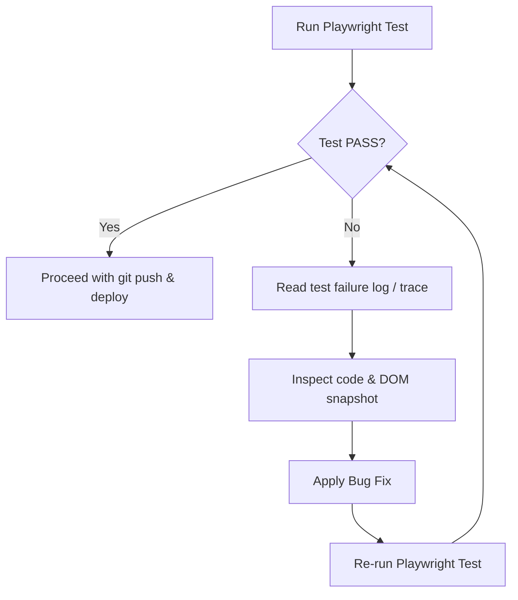

# Playwright Automated Testing & Self-Healing Guidelines

## 1. Playwright Setup & Launch
- **Server Discovery**: Determine the port from `package.json` scripts or `.env` `PORT` (default `3000` if unset). Do not start the dev server yourself and hope the timing works out — a synchronous `npm run dev` blocks the shell before tests can run, and backgrounding it (`&`) pushes the port-readiness wait onto you. Use Playwright's built-in `webServer` option instead, which starts the server, waits for the port, and tears it down after the run:
```javascript
// playwright.config.ts
export default {
  use: { baseURL: 'http://localhost:3000', trace: 'retain-on-failure' },
  webServer: {
    command: 'npm run dev',
    url: 'http://localhost:3000',
    reuseExistingServer: !process.env.CI,
    timeout: 120 * 1000,
  },
};
```
  `reuseExistingServer: !process.env.CI` reuses whatever is already listening on that port locally — before running tests, confirm nothing stale is still bound to it (e.g. a leftover dev server from a previous run serving old code), or the suite will silently validate against outdated code instead of your latest changes.
- **Trace on Failure**: `trace: 'retain-on-failure'` (set above) keeps DOM/network snapshots only for failed runs — use these during the Self-Healing Loop instead of relying on stdout text alone.
- **Headless Execution**: Always execute tests in headless mode:
```bash
npx playwright test
```

---

## 2. Self-Healing Loop (自我修復迴圈)
If the test command fails (exit code !== 0), you must initiate the self-healing workflow. **Only the implementation code may be modified during this loop — never weaken, delete, or skip a failing assertion to force a PASS.** If a test's expectation appears to be wrong rather than the code, stop and report it instead of editing the test.



### Self-Healing Steps:
1. **Analyze Failure**: Read stdout, stderr, and check JSON report or HTML traces inside `test-results/`.
2. **Inspect DOM & State**: Verify element selectors, event handlers, and State transitions.
3. **Apply Code Fixes**: Rewrite the target files immediately.
4. **Retry Validation**: Re-run the tests.
5. **Hard Limit**: Iterate the self-healing loop up to **3 times**. If tests still fail after 3 attempts, halt and report logs to the user.

---

## 3. Basic Test Template
Ensure the project has a valid smoke test configuration to check critical path components:
```javascript
import { test, expect } from '@playwright/test';

test('Smoke Test - Critical Flow Check', async ({ page }) => {
  await page.goto('/'); // resolves against playwright.config.ts baseURL
  
  // 1. Verify layout & elements
  await expect(page.locator('input[type="text"]')).toBeVisible();
  await expect(page.locator('button[type="submit"]')).toBeEnabled();
  
  // 2. Mock sending behavior
  await page.fill('input[type="text"]', 'Hello Agent');
  await page.click('button[type="submit"]');
  
  // 3. Verify interaction response
  await expect(page.locator('.chat-messages')).toContainText('Hello Agent');
});
```
